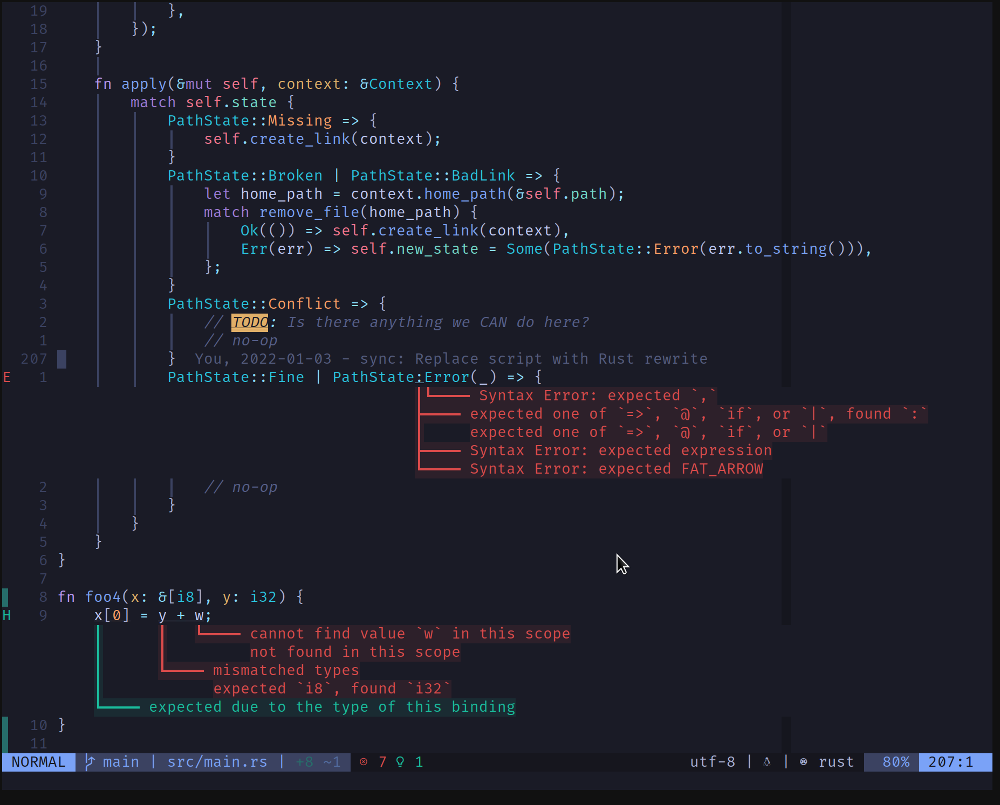

# lsp_lines.nvim

`lsp_lines` is a simple neovim plugin that renders diagnostics using virtual
lines on top of the real line of code.



# Background

LSPs provide lots of useful diagnostics for code (typically: errors, warnings,
linting). By default they're displayed using virtual text at the end of the
line which is in many cases good enough, but often there's more than one
diagnostic per line, or there's a very long diagnostic, and there's no handy
way to read the whole thing.

`lsp_lines` seeks to solve this issue.

# Development

This works well in its current state. Please report any issues you may find.

I've considered using the normal virtual text for all diagnostics and only
using virtual lines for the currently focused line, but that requires some
extra work I haven't had the time for.

# Installation

Using packer.nvim (should probably be registered _after_ `lspconfig`):

```lua
use({
  "https://git.sr.ht/~whynothugo/lsp_lines.nvim",
  config = function()
    require("lsp_lines").register_lsp_virtual_lines()
  end,
})
```

It's recommended to also remove the regular virtual text diagnostics to avoid
pointless duplication:

```lua
-- Disable virtual_text since it's redundant due to lsp_lines.
vim.diagnostic.config({
  virtual_text = false,
})
```

# Contributing

- Discussion or patches: ~whynothugo/lsp_lines.nvim@lists.sr.ht
- Issues: https://todo.sr.ht/~whynothugo/lsp_lines.nvim

# Licence

This project is licensed under the ISC licence. See LICENCE for more details.
